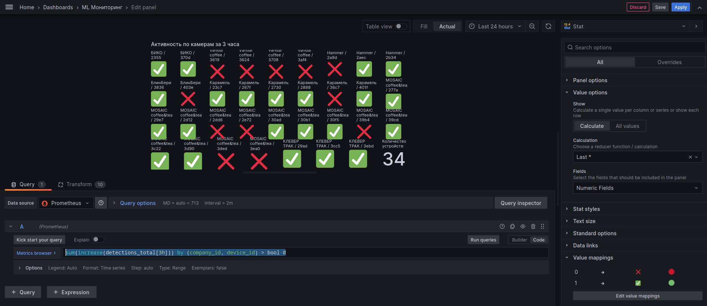
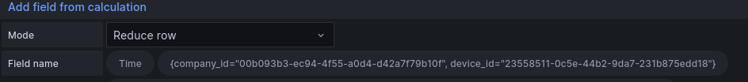

# Grafana

Краткое описание шагов по оформлению мониторинга сервисов

```bash
sum(increase(detections_total[3h])) by (company_id, device_id) > bool 0
```

---



## Transform

### Add field from calculation




### Rename by regex

```bash
^\{company_id="12e2710a-54d5-484e-82ee-6c7ef52ae465", device_id="(.{4})[^"]*"\}$
Vandal coffee / $1

^\{company_id="f5e2bda5-6efb-4760-a8f5-8fc0ab8cff61", device_id="(.{4})[^"]*"\}$
MOSAIC coffee&tea / $1

^\{company_id="b8c02f54-8b55-4c48-be30-94db076654a9", device_id="(.{4})[^"]*"\}$
Карамель / $1

^\{company_id="25d2e1fc-a82a-44d0-b742-1bb0af8790bc", device_id="(.{4})[^"]*"\}$
Hammer / $1

^\{company_id="ca4cf8e7-47ec-4677-ae6f-1226623b3b35", device_id="(.{4})[^"]*"\}$
Корж / $1

^\{company_id="f7b397a4-d4f2-45a5-bba1-2a81333fca60", device_id="(.{4})[^"]*"\}$
КЛЕВЕР ТРАК / $1

^\{company_id="00b093b3-ec94-4f55-a0d4-d42a7f79b10f", device_id="(.{4})[^"]*"\}$
БИКО / $1

^\{company_id="7428eac9-b9a2-462a-81ef-c8ffe7a21631", device_id="(.{4})[^"]*"\}$
TT / $1

^\{company_id="568b440a-5619-4ac1-89ac-d93b569fe666", device_id="(.{4})[^"]*"\}$
БлинБери / $1

^\{company_id="4c201a0b-ea93-4e11-ab59-7683f413dc6b", device_id="(.{4})[^"]*"\}$
Кто-то новый  / $1
```
